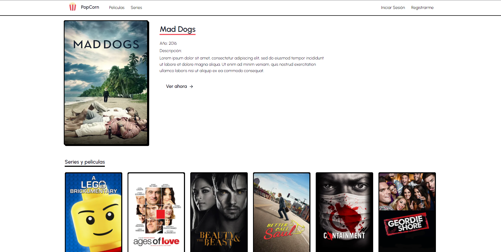

## 🔥 [Demo](https://movies-5vx5o7dp1-nappalm.vercel.app)

## 🔰 Available Scripts

In the project directory, you can run:

### `npm dev`

Runs the app in the development mode.\
Open [http://localhost:3000](http://localhost:3000) to view it in the browser.

The page will reload if you make edits.\

## 📁 Libraries

Emotion Styles, Next.Js, React.JS, Redux, Typescript

## 🗂 Dev Libraries

Eslint, Prettier

## 📢 Comments

### ¿Cómo decidió las opciones técnicas y arquitectónicas utilizadas como parte de su solución?

🔸Por mi experiencia en proyectos similares.

### ¿Hay alguna mejora que pueda hacer en su envío?

🔸Mejorar la organización de archivos, aunque prácticamente es un proyecto pequeño
en un caso realista es algo a tomar en cuenta.

### ¿Qué haría de manera diferente si se le asignara más tiempo?

🔸 Integrar pruebas
